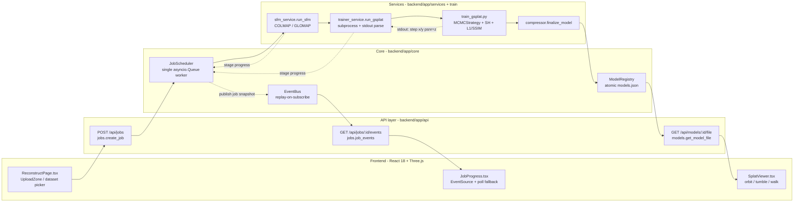
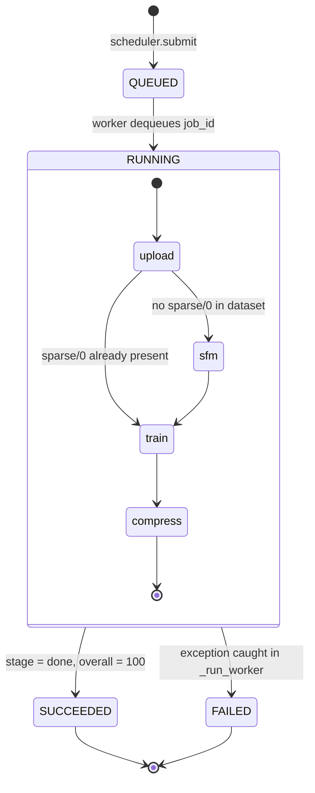

# 3D-Reconstruction

**English** | [简体中文](README.zh-CN.md)

An end-to-end pipeline that turns a folder of photos into a 3D Gaussian Splatting model and serves it to an interactive browser viewer.


---

## Overview

Reconstructing a scene from photographs normally means stitching together several tools by hand: a Structure-from-Motion package, a CUDA training script, an export step, and some way to look at the result. This project wires that chain into a single system — COLMAP/GLOMAP for camera poses, a self-contained gsplat trainer for the Gaussian fit, and a React + Three.js viewer that renders the exported `.ply` in the browser.

The design constraint that shaped most of the engineering was hardware: everything was built and measured on a single RTX 4070 Laptop GPU with 8 GB of VRAM, on Windows. That ruled out the usual `nerfstudio` / `tiny-cuda-nn` / `fused-ssim` stack (which needs a working CUDA toolchain to compile on Windows) and ruled out running jobs concurrently. The result is a deliberately small system: one serial job queue, one subprocess per training run, one dependency (`gsplat`) for the CUDA rasterizer.

## Key Features

- **Full pipeline in one request** — upload images or pick a bundled dataset, and the backend runs COLMAP feature extraction → matching → sparse reconstruction → undistortion → Gaussian training → PLY export without manual steps (`app/core/scheduler.py:99`).
- **Self-contained 3DGS trainer** — 258 lines depending only on `gsplat`, `torch`, `numpy` and `Pillow`: SfM initialization, MCMC adaptive density control, 3rd-degree spherical-harmonic color, L1 + SSIM loss, opacity/scale regularization (`backend/train/train_gsplat.py`).
- **Live progress over SSE** — five weighted stages (0.02 / 0.25 / 0.05 / 0.60 / 0.08) normalized into a single 0–100 bar, pushed over `text/event-stream`, with a 2.5 s polling fallback for buffering proxies (`app/schemas.py:30`, `components/JobProgress.tsx:34`).
- **Three camera modes in the viewer** — orbit (`OrbitControls`), free tumble (`TrackballControls`) and first-person walk (`FlyControls`, for indoor scenes), switchable without reloading the splat scene (`components/SplatViewer.tsx:220`).
- **Outlier-resistant auto-framing** — the viewer samples up to 20,000 splat centers and frames on the median center with a 95th-percentile radius, so distant floaters cannot blow up the bounding box and push the camera out of the scene (`components/SplatViewer.tsx:126`).
- **Reusable artifacts** — every model is registered in `workspace/models.json` through an atomic write, and existing `.ply` / `.splat` / `.ksplat` files can be imported and viewed without a GPU (`app/core/registry.py:37`, `app/api/import_model.py`).

## Architecture



The critical path is one-way and serial. `JobScheduler.submit` assigns a 12-hex-character job id and pushes it onto a single `asyncio.Queue`; one worker coroutine drains that queue, so two reconstructions can never contend for the same 8 GB of VRAM. Inside `_run_pipeline`, each stage reports its own 0–100 progress through a callback, and `_overall` converts it into a global percentage by summing the weights of completed stages plus the weighted fraction of the current one. Training runs as a child process (`asyncio.create_subprocess_exec`), so a CUDA fault kills the subprocess rather than the API server; `trainer_service.on_line` regexes `step x/y` out of its stdout and only emits an event once progress has advanced by at least 1 %, which keeps a 30,000-step run to roughly 100 SSE messages instead of 600. Every progress update is published as a full `Job` snapshot to the `EventBus`, which stores the latest event per job and replays it the instant a client subscribes — so a browser that connects mid-run, or reconnects after a refresh, immediately sees the current state instead of waiting for the next tick.

Job state is two-dimensional: a `JobStatus` lifecycle crossed with a `JobStage` position in the pipeline.



The `upload --> train` edge is the skip path: when a dataset already ships COLMAP poses under `sparse/0`, SfM is marked complete and the pipeline jumps straight to training. Failure is contained at the worker level — `_run_worker` catches any exception from `_run_pipeline`, marks that job `FAILED`, publishes the error message, and then loops to the next queued job, so one bad dataset cannot take the queue down. `JobStatus.CANCELED` is declared in the schema but no transition reaches it (see Limitations).

## Quick Start

### Prerequisites

| Requirement | Version | Why |
|---|---|---|
| NVIDIA GPU + CUDA | 11.8 | gsplat rasterization; measured on RTX 4070 Laptop 8 GB |
| Python | 3.10 (`>=3.10,<3.11`) | the gsplat prebuilt wheel is cp310 only |
| Node.js | >= 18 | Vite 5 |
| COLMAP | Windows binary | SfM; auto-discovered from `PATH` or `third_party/colmap_dist/bin/` |

### Backend

```bash
pip install uv
uv venv backend/.venv --python 3.10

# requirements.lock.txt pins torch 2.4.1+cu118, the cp310 gsplat wheel
# (installed prebuilt, so nothing is compiled locally) and the FastAPI stack
uv pip install --python backend/.venv/Scripts/python.exe \
  -r backend/requirements.lock.txt \
  --index-url https://download.pytorch.org/whl/cu118 \
  --extra-index-url https://pypi.org/simple
```

Download the COLMAP Windows CUDA build and extract it to `third_party/colmap_dist/`. `Settings.resolve_colmap()` checks `PATH` first, then falls back to the bundled copy.

### Frontend

```bash
cd frontend && npm install
```

### Run

```bash
# backend on :8000
cd backend && .venv/Scripts/python.exe -m uvicorn app.main:app --port 8000 --app-dir .

# frontend on :5173 (proxies /api and /static to :8000)
cd frontend && npm run dev
```

On Windows, `start.bat` launches both and opens `http://localhost:5173`. `GET /api/health` reports whether COLMAP, GLOMAP and the trainer script were found.

### Configuration

There is no `.env` file. All paths and training defaults live in `backend/app/config.py` as a frozen `pydantic-settings` model, overridable through environment variables with the `GS_` prefix:

| Variable | Default | Meaning |
|---|---|---|
| `GS_WORKSPACE_DIR` | `<repo>/workspace` | artifact root (tasks, uploads, models) |
| `GS_DATASETS_DIR` | `<repo>/datasets` | scanned for `*/images` and `*/*/images` |
| `GS_COLMAP_BIN` / `GS_GLOMAP_BIN` | `colmap` / `glomap` | executable name or absolute path |
| `GS_DEFAULT_MAX_STEPS` | `30000` | training steps |
| `GS_DEFAULT_DATA_FACTOR` | `4` | image downsample factor (8 GB VRAM safe) |
| `GS_SSIM_LAMBDA` | `0.2` | weight of the SSIM term in the loss |

Datasets are discovered by directory shape: any folder containing an `images/` subdirectory, one or two levels under `datasets/`, becomes a selectable dataset (`app/api/datasets.py:46`).

## Project Structure

```
.
├── backend/
│   ├── app/
│   │   ├── api/                 # FastAPI routers
│   │   │   ├── jobs.py          # POST /jobs, GET /jobs/:id/events (SSE)
│   │   │   ├── models.py        # list / detail / file / save-as / delete
│   │   │   ├── import_model.py  # register an existing .ply/.splat/.ksplat
│   │   │   ├── datasets.py      # scan datasets/ for images/ folders
│   │   │   ├── uploads.py       # multi-file and ZIP ingestion
│   │   │   └── fs.py            # output-path suggestion and writability check
│   │   ├── core/
│   │   │   ├── scheduler.py     # JobScheduler: single-queue serial pipeline
│   │   │   ├── events.py        # EventBus: per-job pub/sub, replay-on-subscribe
│   │   │   └── registry.py      # ModelRegistry: atomic models.json
│   │   ├── services/
│   │   │   ├── sfm_service.py   # COLMAP/GLOMAP invocation + undistortion
│   │   │   ├── trainer_service.py  # subprocess launch + stdout progress parsing
│   │   │   └── compressor.py    # artifact finalization (PLY copy today)
│   │   ├── utils/proc.py        # async subprocess with per-line callback
│   │   ├── config.py            # frozen Settings, GS_ env prefix
│   │   └── schemas.py           # Job / JobStage / STAGE_WEIGHTS / ModelEntry
│   └── train/
│       ├── train_gsplat.py      # the 3DGS trainer (MCMC, SH, L1+SSIM, PLY export)
│       └── colmap_io.py         # binary COLMAP model reader, no pycolmap
├── frontend/src/
│   ├── pages/                   # GalleryPage / ReconstructPage / ViewerPage / ComparePage
│   ├── components/SplatViewer.tsx  # Three.js + gaussian-splats-3d wrapper
│   ├── api/{client,sse}.ts      # axios client and EventSource subscription
│   └── store/useStore.ts        # zustand store for session-local imports
├── scripts/plot_psnr_curve.py   # PSNR-vs-steps figure from a training log
├── datasets/                    # input images (gitignored)
├── third_party/colmap_dist/     # bundled COLMAP binaries (gitignored)
└── workspace/                   # jobs, uploads, models, models.json (gitignored)
```

## Design Notes

**A single serial queue instead of a task broker.** `JobScheduler` is one `asyncio.Queue` drained by one worker coroutine. The alternative — Celery or RQ with Redis — buys parallelism and persistence, neither of which helps here: COLMAP's CUDA matcher and the gsplat trainer both want the same 8 GB of VRAM, so a second concurrent job would OOM rather than finish sooner. The costs are real and accepted: job state lives in a plain dict (`JobScheduler._jobs`), so history is lost on restart, and there is no way to preempt a running job.

**Training runs as a subprocess, not in the event loop.** `trainer_service.run_gsplat` shells out to `train_gsplat.py` through `asyncio.create_subprocess_exec` and parses stdout. Importing torch and gsplat into the FastAPI process would have been simpler and would give structured progress instead of a regex over `step x/y` — but a CUDA OOM or an illegal-memory-access inside the rasterizer would then take the whole API server with it, and the SSE stream that reports the failure would die alongside it. Process isolation trades progress fidelity for the ability to report a crash. The `on_line` callback additionally throttles emission to 1 % increments, because a 30,000-step run prints every 50 steps and forwarding all 600 lines as SSE frames is pure overhead.

**Replay-on-subscribe instead of an event log.** `EventBus` keeps `_last[job_id]`, the most recent snapshot per job, and yields it immediately when a new subscriber attaches. The alternatives were a full ring buffer per job (more memory, and the client only ever renders the latest state anyway) or nothing at all — which breaks the common case, since the browser calls `POST /jobs` and only then opens the `EventSource`, and any event published in that window would be lost. Because the messages are complete `Job` snapshots rather than deltas, one replayed event is enough to render a correct UI. The frontend still runs a 2.5 s poll in parallel, because an SSE stream can be silently buffered by an intermediate proxy.

**A 258-line trainer instead of nerfstudio.** The reference implementation, `gsplat/examples/simple_trainer.py`, pulls in `fused-ssim`, `viser`, `nerfview` and tensorboard; on Windows those either need a working CUDA/C++ toolchain or fail at install time. `train_gsplat.py` reimplements only what the pipeline needs — SfM initialization with kNN-derived scales, `MCMCStrategy`, progressive SH activation (`active_sh = step // 1000`), L1 + SSIM loss, PLY export — against `gsplat` alone. The SSIM is a plain PyTorch Gaussian-window convolution rather than the fused CUDA kernel, which is slower per step; `colmap_io.py` parses `cameras.bin` / `images.bin` / `points3D.bin` by hand rather than depending on `pycolmap`, which is another package that does not install cleanly on Windows. The cost of this choice is maintenance: upstream improvements to the reference trainer do not flow in.

**Regularize during training, then prune at export.** MCMC density control left unconstrained grows large, spiky, near-transparent Gaussians — visible as floating shards around the subject. The loss therefore adds an opacity term and a scale term (`opacity_reg = scale_reg = 0.01`), and the Gaussian budget is scaled to the training length (`min(cap_max, max(80_000, max_steps * 20))`) so that a short run optimizes fewer primitives properly rather than many badly. Export then applies a second filter: drop Gaussians with opacity ≤ 0.05, and drop those whose largest axis exceeds three times the 99.5th percentile. Two passes rather than one because they catch different failure modes — the regularizer shapes the optimization, the export filter removes what survived it.

**Median-based framing rather than a bounding box.** A bounding box over a trained splat cloud is dominated by its outliers: a handful of floaters hundreds of units away make the box enormous, the camera is placed far outside it, and the scene renders as a dot. `autoFrame` samples up to 20,000 centers, takes the component-wise median as the look-at point and the 95th-percentile distance as the radius. It is an approximation — the true extent is discarded — but it is the one that makes an arbitrary uploaded model visible on first load without manual camera tuning.

## Results

All figures below come from one hardware configuration: RTX 4070 Laptop GPU (8 GB), CUDA 11.8, gsplat 1.5.2, on the Tanks&Temples `train` scene (301 images, `data_factor=4`).

**PSNR is a training-view metric, not a hold-out test score.** It is computed in `train_gsplat.py:223` as `-10 log10(MSE)` between the render and the ground-truth image of the view being optimized at that step. There is no held-out split anywhere in the pipeline, so these numbers are not comparable to published test-set PSNR on the same scene.

Training-step ablation:

| Steps | PSNR (train view, dB) | Wall time | Quality |
|---|---|---|---|
| 3,000 | 19.5 | ~35 s | pipeline smoke test; subject clearly blurred |
| 7,000 | 21.4 | ~80 s | subject recognizable, edges and background soft |
| 30,000 | 26.1 | ~15 min | sharp; lettering on the locomotive is legible |

MCMC regularization ablation at 30,000 steps:

| Configuration | PSNR (train view, dB) | Gaussians | PLY size |
|---|---|---|---|
| No regularization | 25.5 | 281,406 | 63 MB |
| `opacity_reg` + `scale_reg` = 0.01 | 26.1 | 226,174 | 50 MB |

Regularization removed roughly 20 % of the Gaussians and 21 % of the file size while PSNR went up rather than down — the pruned primitives were contributing floaters, not detail. The Gaussian counts and file sizes are verifiable against the PLY headers of the two runs kept under `workspace/tasks/`.

`scripts/plot_psnr_curve.py` regenerates the PSNR-vs-steps figure from a training log, annotating the 3k / 7k / 30k anchors above.

## Limitations

- **`.ksplat` compression is not implemented.** `compressor.finalize_model` copies the PLY and nothing more (`shutil.copy2`, `services/compressor.py:32`); the module docstring describes the conversion as planned work. `ModelMetrics.ksplat_mb` is therefore always `null`, and models are served to the browser as full-size PLY — 50 MB for a 30k model. The viewer can *load* `.ksplat` files, so imported ones work; the pipeline just never produces them.
- **The Brush engine comparison was not built.** `Engine.BRUSH` exists in `schemas.py` and in the frontend types, but no code path dispatches to it. `ComparePage` compares two models side by side and displays ablation tables — it does not compare two reconstruction engines.
- **Jobs cannot be canceled.** `JobStatus.CANCELED` is declared and the frontend handles it, but there is no cancel endpoint and no transition that sets it. A submitted job runs to completion or failure.
- **Job state is in-memory.** `JobScheduler._jobs` and `_requests` are plain dicts; restarting the backend loses all job history. Only the model registry (`workspace/models.json`) survives, and it is written through a temp-file rename for atomicity.
- **Quality metrics are never persisted.** The scheduler records only `train_seconds` and `ply_mb` into the registry. `ModelMetrics` has `psnr`, `ssim` and `lpips` fields; none are ever populated, so the gallery's PSNR badge never renders.
- **The save-as endpoint has no UI.** `POST /api/models/:id/save-as` works and `saveModelAs` is exported from `api/client.ts`, but no component calls it. Choosing an output location is only possible up front, through the job's `output_dir`.
- **Windows-only in practice.** The default interpreter path is `backend/.venv/Scripts/python.exe`, the bundled binaries are `colmap.exe` / `glomap.exe`, and the launchers are `.bat`. `sfm_service` also stages every input image into an ASCII-only relative path before invoking COLMAP, because FreeImage cannot open absolute paths containing non-ASCII characters on Windows.
- **No tests, no auth.** There is no test suite in the repository. CORS is hardcoded to `localhost:5173` and there is no authentication — this is a single-user local tool, as stated in `DEV_SPEC.md` §1.3.
- **SfM uses CPU SIFT.** `FeatureExtraction.use_gpu` is set to `0` because SiftGPU needs an OpenGL context that a headless background process cannot create; only the matcher runs on GPU. Feature extraction is correspondingly slow on large image sets.
- **The `undistort` stage is weighted but never emitted.** `STAGE_WEIGHTS` reserves 0.05 for it, and undistortion does run — but inside `sfm_service.run_sfm`, so the progress bar never displays `undistort` as a distinct stage.

## License

MIT — see [LICENSE](LICENSE).

Third-party components carry their own terms: gsplat (Apache-2.0), COLMAP (BSD), `@mkkellogg/gaussian-splats-3d` (MIT). The original 3D Gaussian Splatting work from INRIA is released under a non-commercial research license.
