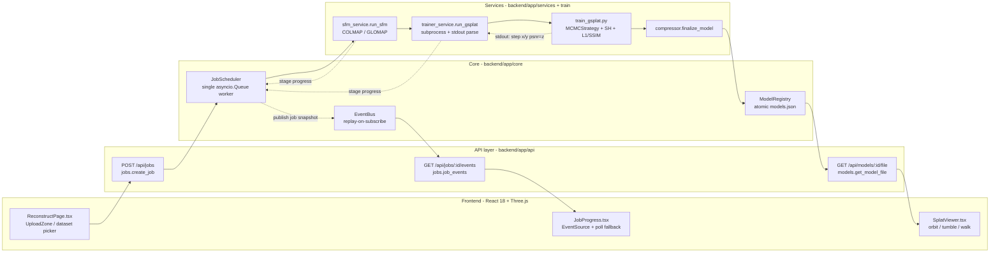
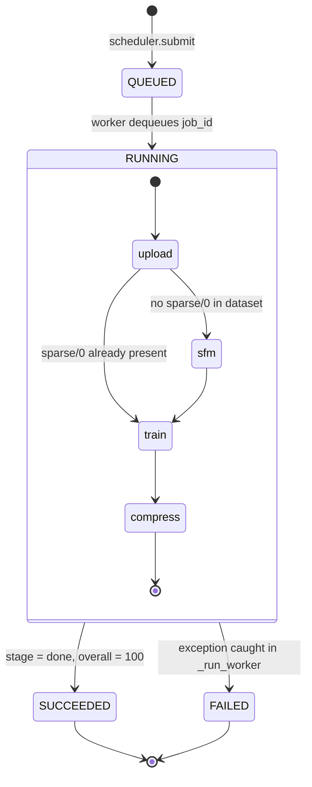

# 3D-Reconstruction

[English](README.md) | **简体中文**

一条端到端流水线：把一组照片重建为 3D Gaussian Splatting 模型，并在浏览器中交互查看。


---

## Overview（概览）

从照片重建三维场景，通常意味着手工串起若干工具：一个 SfM（Structure-from-Motion，运动恢复结构）软件、一个 CUDA 训练脚本、一个导出步骤，再加上某种查看方式。本项目把这条链路整合成一套系统——用 COLMAP/GLOMAP 求相机位姿，用自研的精简 gsplat 训练器完成高斯拟合，再由 React + Three.js 查看器在浏览器里渲染导出的 `.ply`。

真正塑造了大部分工程决策的约束是硬件：全部开发与实测都在一块 8 GB 显存的 RTX 4070 Laptop GPU 上、在 Windows 平台完成。这既排除了常规的 `nerfstudio` / `tiny-cuda-nn` / `fused-ssim` 技术栈（它们在 Windows 上需要可用的 CUDA 编译工具链），也排除了并发执行任务的可能。最终的系统是刻意做小的：一条串行任务队列、每次训练一个子进程、CUDA 光栅化只依赖 `gsplat` 一个包。

## Key Features（核心特性）

- **一次请求跑完整条流水线** —— 上传图片或选择内置数据集，后端依次执行 COLMAP 特征提取 → 匹配 → 稀疏重建 → 去畸变 → 高斯训练 → PLY 导出，无需人工介入（`app/core/scheduler.py:99`）。
- **自包含的 3DGS 训练器** —— 258 行代码，仅依赖 `gsplat`、`torch`、`numpy` 与 `Pillow`：SfM 初始化、MCMC 自适应密度控制、3 阶球谐（Spherical Harmonics，SH）颜色、L1 + SSIM 损失、不透明度/尺度正则项（`backend/train/train_gsplat.py`）。
- **基于 SSE 的实时进度** —— 五个加权阶段（0.02 / 0.25 / 0.05 / 0.60 / 0.08）归一化为单一的 0–100 进度条，经 `text/event-stream` 推送，并有 2.5 秒轮询兜底以应对代理缓冲（`app/schemas.py:30`、`components/JobProgress.tsx:34`）。
- **查看器三种相机模式** —— 环视（`OrbitControls`）、自由翻滚（`TrackballControls`）、第一人称漫游（`FlyControls`，适合室内场景），切换时不重新加载 splat 场景（`components/SplatViewer.tsx:220`）。
- **抗离群值的自动取景** —— 查看器采样至多 20,000 个高斯中心，以中位数为视觉中心、95 分位距离为半径取景，使远处漂浮物无法撑大包围盒、把相机推到场景之外（`components/SplatViewer.tsx:126`）。
- **产物可复用** —— 每个模型都通过原子写入注册到 `workspace/models.json`；已有的 `.ply` / `.splat` / `.ksplat` 文件可直接导入查看，无需 GPU（`app/core/registry.py:37`、`app/api/import_model.py`）。

## Architecture（架构）



关键路径是单向且串行的。`JobScheduler.submit` 分配一个 12 位十六进制的 job id 并压入唯一的 `asyncio.Queue`；只有一个 worker 协程消费该队列，因此两次重建绝不会争抢同一块 8 GB 显存。在 `_run_pipeline` 内部，每个阶段通过回调上报自身 0–100 的进度，`_overall` 再把它换算为全局百分比——已完成阶段的权重之和，加上当前阶段权重乘以其完成比例。训练以子进程方式运行（`asyncio.create_subprocess_exec`），因此 CUDA 崩溃杀掉的是子进程而非 API 服务；`trainer_service.on_line` 用正则从 stdout 中抽取 `step x/y`，且仅在进度前进至少 1 % 时才发事件，这让一次 30,000 步训练约推送 100 条 SSE 消息而不是 600 条。每次进度更新都以完整的 `Job` 快照发布到 `EventBus`，后者保存每个任务的最新事件，并在客户端订阅的瞬间立即重放——于是中途连入、或刷新后重连的浏览器会立刻看到当前状态，而不必等下一次推送。

任务状态是二维的：`JobStatus` 生命周期，与 `JobStage` 在流水线中的位置相交叉。



`upload --> train` 这条边是跳过路径：当数据集自带 `sparse/0` 下的 COLMAP 位姿时，SfM 被直接标记为完成，流水线跳到训练。故障被隔离在 worker 层——`_run_worker` 捕获 `_run_pipeline` 抛出的任何异常，将该任务标记为 `FAILED`、推送错误信息，然后继续处理队列中的下一个任务，因此一份坏数据集不会拖垮整条队列。`JobStatus.CANCELED` 在 schema 中有声明，但没有任何迁移会到达它（见 Limitations）。

## Quick Start（快速开始）

### 前置依赖

| 依赖 | 版本 | 原因 |
|---|---|---|
| NVIDIA GPU + CUDA | 11.8 | gsplat 光栅化；实测环境为 RTX 4070 Laptop 8 GB |
| Python | 3.10（`>=3.10,<3.11`） | gsplat 预编译 wheel 仅提供 cp310 |
| Node.js | >= 18 | Vite 5 |
| COLMAP | Windows 二进制 | SfM；自动从 `PATH` 或 `third_party/colmap_dist/bin/` 发现 |

### 后端

```bash
pip install uv
uv venv backend/.venv --python 3.10

# requirements.lock.txt 已锁定 torch 2.4.1+cu118、cp310 的 gsplat wheel
# （直接装预编译包，本地不编译任何 CUDA 代码）以及 FastAPI 相关依赖
uv pip install --python backend/.venv/Scripts/python.exe \
  -r backend/requirements.lock.txt \
  --index-url https://download.pytorch.org/whl/cu118 \
  --extra-index-url https://pypi.org/simple
```

下载 COLMAP 的 Windows CUDA 版本并解压到 `third_party/colmap_dist/`。`Settings.resolve_colmap()` 先查 `PATH`，找不到时回退到内置副本。

### 前端

```bash
cd frontend && npm install
```

### 运行

```bash
# 后端 :8000
cd backend && .venv/Scripts/python.exe -m uvicorn app.main:app --port 8000 --app-dir .

# 前端 :5173（将 /api 与 /static 代理到 :8000）
cd frontend && npm run dev
```

在 Windows 上，`start.bat` 会同时启动两者并打开 `http://localhost:5173`。`GET /api/health` 会报告是否找到了 COLMAP、GLOMAP 与训练脚本。

### 配置

项目没有 `.env` 文件。所有路径与训练默认值都位于 `backend/app/config.py`，是一个不可变（frozen）的 `pydantic-settings` 模型，可通过 `GS_` 前缀的环境变量覆盖：

| 变量 | 默认值 | 含义 |
|---|---|---|
| `GS_WORKSPACE_DIR` | `<repo>/workspace` | 产物根目录（tasks、uploads、models） |
| `GS_DATASETS_DIR` | `<repo>/datasets` | 扫描 `*/images` 与 `*/*/images` |
| `GS_COLMAP_BIN` / `GS_GLOMAP_BIN` | `colmap` / `glomap` | 可执行文件名或绝对路径 |
| `GS_DEFAULT_MAX_STEPS` | `30000` | 训练步数 |
| `GS_DEFAULT_DATA_FACTOR` | `4` | 图像降采样倍数（8 GB 显存安全值） |
| `GS_SSIM_LAMBDA` | `0.2` | 损失中 SSIM 项的权重 |

数据集按目录形态发现：`datasets/` 下一到两层内、任何包含 `images/` 子目录的文件夹都会成为可选数据集（`app/api/datasets.py:46`）。

## Project Structure（目录结构）

```
.
├── backend/
│   ├── app/
│   │   ├── api/                 # FastAPI 路由
│   │   │   ├── jobs.py          # POST /jobs、GET /jobs/:id/events (SSE)
│   │   │   ├── models.py        # 列表 / 详情 / 文件 / 另存为 / 删除
│   │   │   ├── import_model.py  # 注册已有的 .ply/.splat/.ksplat
│   │   │   ├── datasets.py      # 扫描 datasets/ 下的 images/ 目录
│   │   │   ├── uploads.py       # 多文件与 ZIP 接收
│   │   │   └── fs.py            # 输出路径建议与可写性校验
│   │   ├── core/
│   │   │   ├── scheduler.py     # JobScheduler：单队列串行流水线
│   │   │   ├── events.py        # EventBus：按 job 发布/订阅，订阅即重放
│   │   │   └── registry.py      # ModelRegistry：原子写入 models.json
│   │   ├── services/
│   │   │   ├── sfm_service.py   # 调用 COLMAP/GLOMAP + 去畸变
│   │   │   ├── trainer_service.py  # 拉起子进程 + 解析 stdout 进度
│   │   │   └── compressor.py    # 产物整理（当前仅拷贝 PLY）
│   │   ├── utils/proc.py        # 带按行回调的异步子进程封装
│   │   ├── config.py            # 不可变 Settings，GS_ 环境变量前缀
│   │   └── schemas.py           # Job / JobStage / STAGE_WEIGHTS / ModelEntry
│   └── train/
│       ├── train_gsplat.py      # 3DGS 训练器（MCMC、SH、L1+SSIM、PLY 导出）
│       └── colmap_io.py         # COLMAP 二进制模型读取器，不依赖 pycolmap
├── frontend/src/
│   ├── pages/                   # GalleryPage / ReconstructPage / ViewerPage / ComparePage
│   ├── components/SplatViewer.tsx  # Three.js + gaussian-splats-3d 封装
│   ├── api/{client,sse}.ts      # axios 客户端与 EventSource 订阅
│   └── store/useStore.ts        # zustand：会话内导入模型的状态
├── scripts/plot_psnr_curve.py   # 从训练日志绘制 PSNR-步数曲线
├── datasets/                    # 输入图像（已 gitignore）
├── third_party/colmap_dist/     # 内置 COLMAP 二进制（已 gitignore）
└── workspace/                   # 任务、上传、模型、models.json（已 gitignore）
```

## Design Notes（关键设计取舍）

**用单条串行队列，而不是任务代理（task broker）。** `JobScheduler` 只是一个 `asyncio.Queue`，由一个 worker 协程消费。备选方案——Celery 或 RQ 配 Redis——买来的是并行与持久化，而这两者在这里都不解决问题：COLMAP 的 CUDA 匹配器与 gsplat 训练器都要用同一块 8 GB 显存，第二个并发任务只会 OOM，而不会更早完成。代价是真实且被接受的：任务状态存在普通 dict（`JobScheduler._jobs`）里，重启即丢失历史；也没有办法抢占正在运行的任务。

**训练跑在子进程里，而不是事件循环里。** `trainer_service.run_gsplat` 通过 `asyncio.create_subprocess_exec` 拉起 `train_gsplat.py` 并解析 stdout。把 torch 与 gsplat 直接 import 进 FastAPI 进程会更简单，也能拿到结构化进度而不是对 `step x/y` 做正则——但那样一次 CUDA OOM 或光栅化内核里的非法内存访问就会带走整个 API 服务，连负责上报这次失败的 SSE 流也一并死掉。进程隔离用进度精度换来了「能把崩溃报出来」的能力。`on_line` 回调还把事件发送节流到 1 % 的步进，因为 30,000 步训练每 50 步打印一行，把全部 600 行都转成 SSE 帧纯属开销。

**订阅即重放，而不是事件日志。** `EventBus` 保存 `_last[job_id]`，即每个任务的最新快照，并在新订阅者接入时立即产出。备选方案要么是每个任务一个完整环形缓冲（更占内存，而客户端反正只渲染最新状态），要么什么都不做——后者会破坏最常见的路径：浏览器先调 `POST /jobs`、之后才打开 `EventSource`，这个窗口期内发布的事件会全部丢失。由于消息是完整的 `Job` 快照而非增量，一条重放事件就足以渲染出正确的界面。前端仍并行跑一个 2.5 秒轮询，因为 SSE 流可能被中间代理静默缓冲。

**用 258 行的训练器，而不是 nerfstudio。** 参考实现 `gsplat/examples/simple_trainer.py` 会引入 `fused-ssim`、`viser`、`nerfview` 与 tensorboard；在 Windows 上它们要么需要可用的 CUDA/C++ 工具链，要么直接安装失败。`train_gsplat.py` 只重新实现流水线需要的部分——基于 kNN 距离的尺度初始化、`MCMCStrategy`、渐进式 SH 激活（`active_sh = step // 1000`）、L1 + SSIM 损失、PLY 导出——且只依赖 `gsplat`。其中 SSIM 是纯 PyTorch 的高斯窗卷积，而非融合 CUDA 内核，每步更慢；`colmap_io.py` 手工解析 `cameras.bin` / `images.bin` / `points3D.bin`，而不依赖 `pycolmap`——那是另一个在 Windows 上装不干净的包。这个选择的代价是维护性：上游参考训练器的改进不会自动流入。

**训练期正则，导出期再剪枝。** MCMC 密度控制若不加约束，会长出又大又尖、接近全透明的高斯——在画面上表现为主体周围的飞散碎片。因此损失中加入了不透明度项与尺度项（`opacity_reg = scale_reg = 0.01`），并且高斯预算随训练长度缩放（`min(cap_max, max(80_000, max_steps * 20))`），让短训练去充分优化更少的基元，而不是草率地优化很多。导出阶段再施加第二道过滤：剔除不透明度 ≤ 0.05 的高斯，以及最大轴尺度超过 99.5 分位三倍的高斯。之所以做两遍而不是一遍，是因为它们针对不同的失效模式——正则项塑造优化过程，导出过滤清除幸存下来的残留。

**基于中位数的取景，而不是包围盒。** 对训练出的 splat 点云取包围盒，结果会被离群点主导：只要有少数几个漂浮物远在几百单位之外，盒子就会变得巨大，相机被放到盒外很远处，整个场景渲染成一个点。`autoFrame` 采样至多 20,000 个中心，取分量中位数作为视点目标、95 分位距离作为半径。这是个近似——真实范围被丢弃了——但它能让任意上传的模型在首次加载时就可见，无需手动调整相机。

## Results（实测结果）

以下所有数字都来自同一套硬件配置：RTX 4070 Laptop GPU（8 GB）、CUDA 11.8、gsplat 1.5.2，场景为 Tanks&Temples 的 `train`（301 张图像，`data_factor=4`）。

**PSNR 是训练视角（train view）指标，不是 hold-out 测试集分数。** 它在 `train_gsplat.py:223` 中计算，为当前步所优化视角的渲染图与真值图之间的 `-10 log10(MSE)`。整条流水线中不存在任何留出划分，因此这些数字不能与同一场景上公开发表的测试集 PSNR 相比较。

训练步数消融：

| 步数 | PSNR（训练视角, dB） | 耗时 | 质量 |
|---|---|---|---|
| 3,000 | 19.5 | ~35 秒 | 仅验证流程；主体明显模糊 |
| 7,000 | 21.4 | ~80 秒 | 主体可辨识，边缘与背景偏软 |
| 30,000 | 26.1 | ~15 分钟 | 清晰；机车车身文字可读 |

30,000 步下的 MCMC 正则项消融：

| 配置 | PSNR（训练视角, dB） | 高斯数 | PLY 体积 |
|---|---|---|---|
| 无正则项 | 25.5 | 281,406 | 63 MB |
| `opacity_reg` + `scale_reg` = 0.01 | 26.1 | 226,174 | 50 MB |

正则项剔除了约 20 % 的高斯与 21 % 的文件体积，而 PSNR 不降反升——被剪掉的基元贡献的是漂浮物，不是细节。高斯数与文件体积可以用 `workspace/tasks/` 下保留的两次运行的 PLY 文件头核对。

`scripts/plot_psnr_curve.py` 可从训练日志重新绘制 PSNR-步数曲线，并标注上表中的 3k / 7k / 30k 三个锚点。

## Limitations（已知局限）

- **`.ksplat` 压缩未实现。** `compressor.finalize_model` 只是拷贝 PLY，没有别的（`shutil.copy2`，`services/compressor.py:32`）；模块 docstring 把该转换描述为计划中的工作。因此 `ModelMetrics.ksplat_mb` 恒为 `null`，模型以完整体积的 PLY 送到浏览器——30k 模型即 50 MB。查看器能够**加载** `.ksplat`，所以导入的此类文件可用；只是流水线从不产出它。
- **Brush 引擎对比没有做。** `Engine.BRUSH` 存在于 `schemas.py` 与前端类型中，但没有任何代码路径会分发到它。`ComparePage` 做的是两个模型的并排对比与消融数据展示——不是两种重建引擎的对比。
- **任务无法取消。** `JobStatus.CANCELED` 有声明、前端也处理了它，但既没有取消接口，也没有任何迁移会设置该状态。提交的任务只能跑到成功或失败。
- **任务状态仅存内存。** `JobScheduler._jobs` 与 `_requests` 是普通 dict；重启后端即丢失全部任务历史。只有模型注册表（`workspace/models.json`）会留存，且通过临时文件重命名保证原子性。
- **质量指标从不落盘。** 调度器只把 `train_seconds` 与 `ply_mb` 写入注册表。`ModelMetrics` 有 `psnr`、`ssim`、`lpips` 字段，但从未被填充，因此模型库里的 PSNR 标签永远不会显示。
- **另存为接口没有界面入口。** `POST /api/models/:id/save-as` 可用，`saveModelAs` 也从 `api/client.ts` 导出，但没有组件调用它。选择输出位置只能在发起任务时通过 `output_dir` 预先指定。
- **实际上只跑在 Windows。** 默认解释器路径是 `backend/.venv/Scripts/python.exe`，内置二进制是 `colmap.exe` / `glomap.exe`，启动脚本是 `.bat`。`sfm_service` 还会先把所有输入图像暂存到纯 ASCII 的相对路径再调用 COLMAP，因为在 Windows 上 FreeImage 无法打开含非 ASCII 字符的绝对路径。
- **没有测试，没有鉴权。** 仓库中不存在测试套件。CORS 硬编码为 `localhost:5173`，也没有任何身份认证——按 `DEV_SPEC.md` §1.3 的定位，这是一个单用户本地工具。
- **SfM 使用 CPU SIFT。** `FeatureExtraction.use_gpu` 被设为 `0`，因为 SiftGPU 需要一个无窗口后台进程无法创建的 OpenGL 上下文；只有匹配阶段跑在 GPU 上。相应地，大图像集上的特征提取很慢。
- **`undistort` 阶段有权重却从不单独上报。** `STAGE_WEIGHTS` 为它保留了 0.05，去畸变也确实执行了——但发生在 `sfm_service.run_sfm` 内部，因此进度条从不把 `undistort` 显示为一个独立阶段。

## License（许可）

MIT —— 见 [LICENSE](LICENSE)。

第三方组件遵循各自的条款：gsplat（Apache-2.0）、COLMAP（BSD）、`@mkkellogg/gaussian-splats-3d`（MIT）。INRIA 的原始 3D Gaussian Splatting 工作以非商业研究许可发布。
