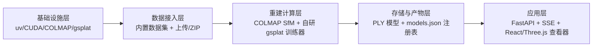
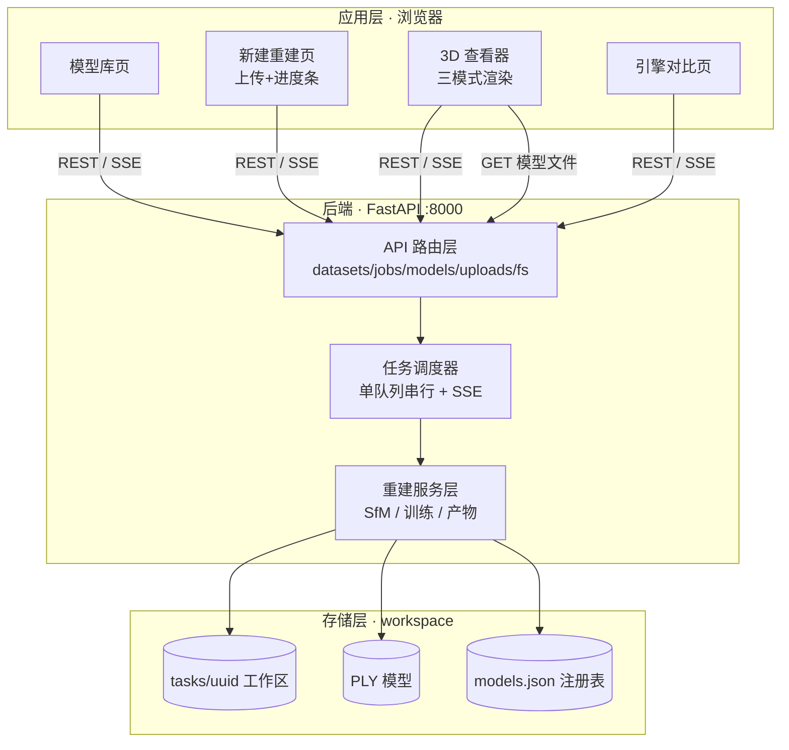
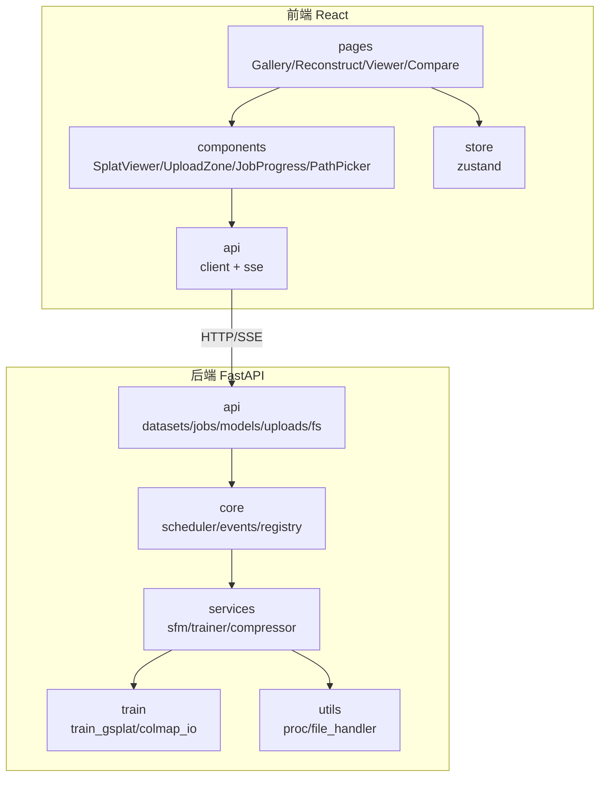
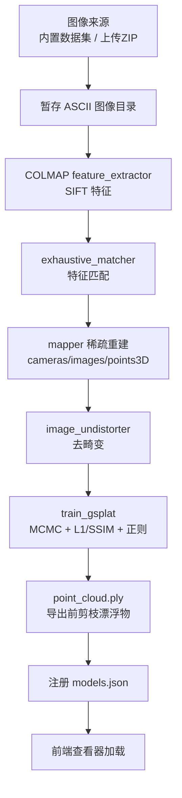
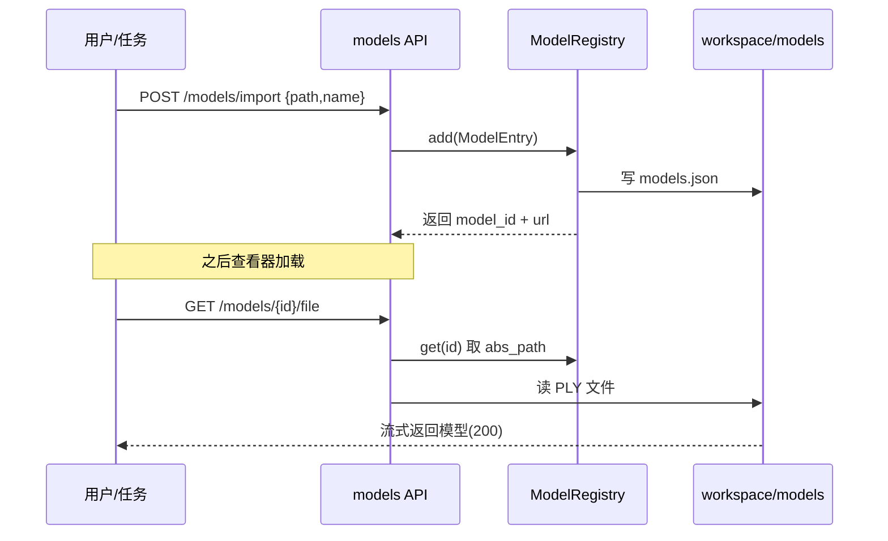
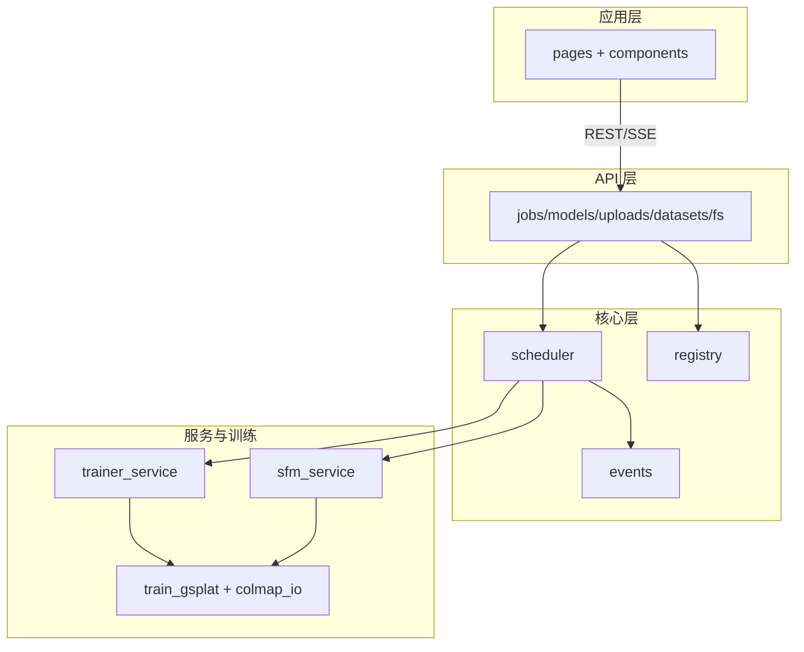
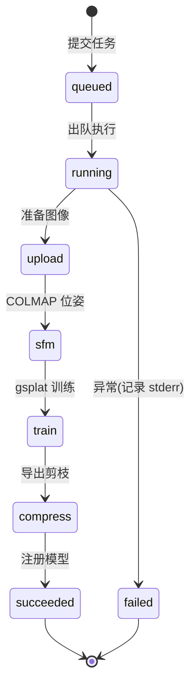
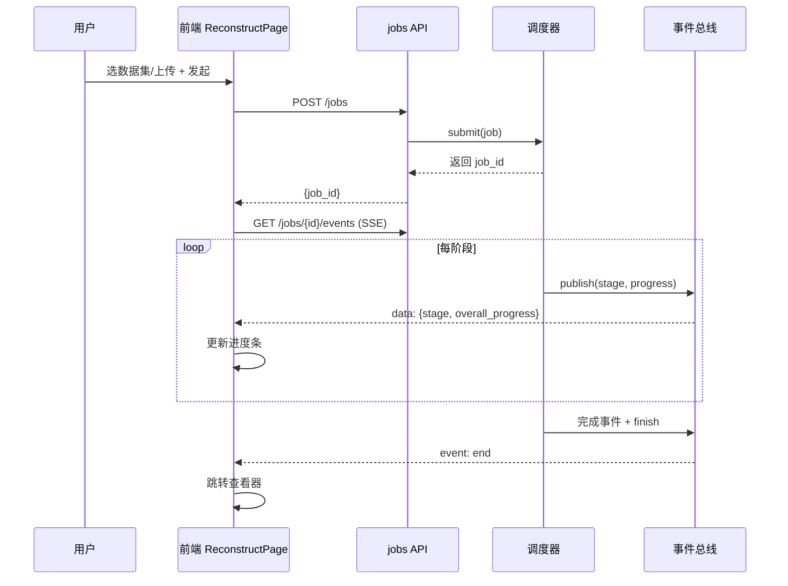
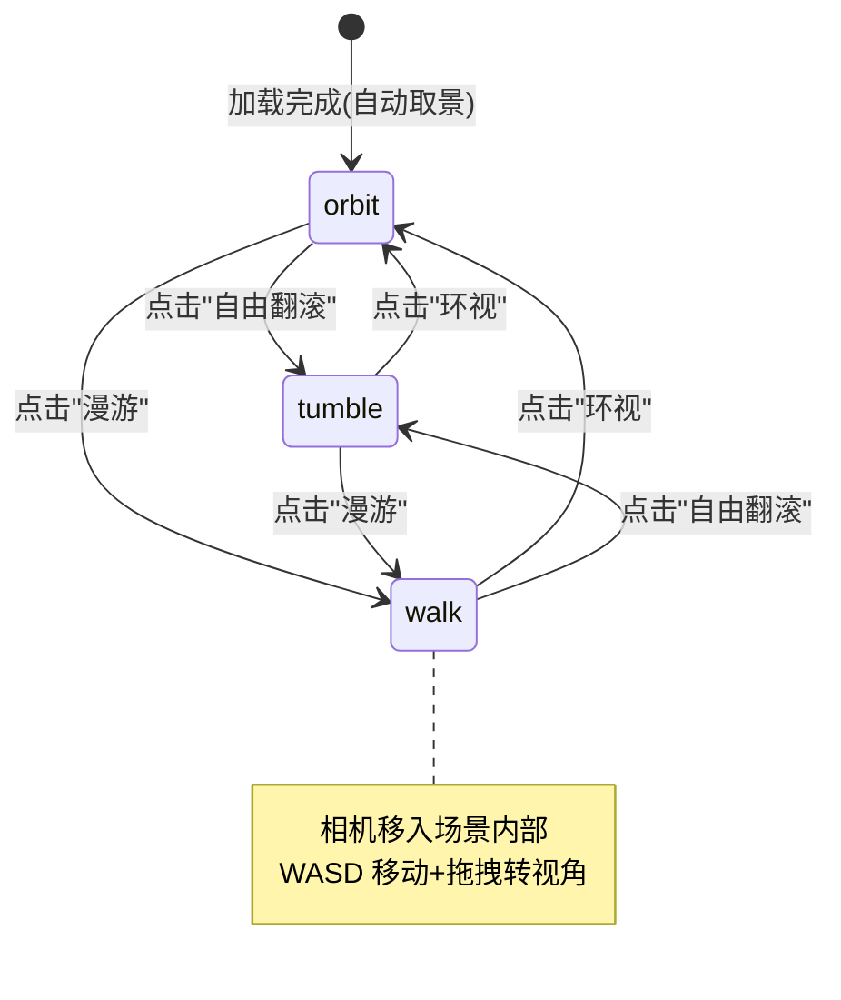

# 基于三维高斯泼溅的交互式三维重建与可视化系统——计算机视觉课程设计报告

> **项目名称**：基于 3D Gaussian Splatting 的交互式三维重建与可视化系统
> **课程**：计算机视觉实践
> **关键词**：3D Gaussian Splatting · Structure-from-Motion · COLMAP · gsplat · MCMC 自适应密度控制 · Three.js WebGL 实时渲染 · 前后端分离
> **姓名**：____________　**学号**：____________　**指导教师**：____________　**日期**：2026 年 6 月

---

## 摘要

本项目面向「从一组二维照片重建三维场景并在浏览器中实时交互查看」这一计算机视觉核心场景，构建了一条覆盖 **数据采集 → 相机位姿求解（SfM）→ 三维高斯拟合训练 → 显式模型导出 → 浏览器实时渲染** 的端到端三维重建流水线。系统采用**前后端分离**架构：后端以 **FastAPI** 组织，串联 **COLMAP** 稀疏重建与**自研精简 gsplat 训练器**，通过单队列串行任务调度与 **SSE**（Server-Sent Events）向前端实时推送三阶段进度；前端以 **React 18 + TypeScript + Three.js + @mkkellogg/gaussian-splats-3d** 实现模型库、上传重建、三模式（环视 / 自由翻滚 / 漫游）可拖拽查看器与引擎参数对比页。

在算法侧，本系统实现了完整的 **3D Gaussian Splatting** 训练闭环：以 SfM 稀疏点云初始化各向异性高斯椭球，采用 **MCMC 自适应密度控制**管理高斯增殖，以 **L1 + SSIM** 联合损失优化，并引入 **不透明度正则项与尺度正则项** 抑制"又大又尖"的漂浮高斯。为规避 Windows 平台 nerfstudio / tiny-cuda-nn / fused-ssim 的 CUDA 编译难题，训练器仅依赖 gsplat 本体，实测在 **RTX 4070 Laptop（8GB 显存）** 上稳定可行。

在真实数据集 Tanks&Temples 的 `train` 场景上，30000 步训练达到 **PSNR 26.1**，渲染帧率稳定于 **40 FPS 以上**；训练步数消融（3k / 7k / 30k）与 MCMC 正则项消融实验验证了各项设计的有效性——正则项在 PSNR 不降反升的同时剔除约 **20%** 冗余漂浮高斯，模型体积下降约 **21%**。本报告详述该系统的设计动机、技术选型、系统架构、核心算法、模块实现与运行成果。

---

## 目录

1. 引言
2. 设计内容与技术选型
3. 系统架构设计
4. 核心理论与算法
5. 核心模块划分与实现
6. 系统运行与成果展示
7. 总结与展望
8. 致谢
9. 参考文献

---

# 1 引言

## 1.1 课题背景

从有限视角的二维图像集合中恢复出高保真度、具有视点相关（View-dependent）光影效果的连续三维场景，是计算机视觉与三维几何重建长期关注的核心问题。近年来，**神经辐射场（Neural Radiance Fields, NeRF）** 与 **三维高斯泼溅（3D Gaussian Splatting, 3DGS）** 成为新视角合成（Novel View Synthesis）领域的两大主流范式。NeRF 以隐式 MLP 编码场景，渲染质量高但推理速度极慢，难以在浏览器端流畅交互；3DGS 则以数百万个显式各向异性高斯椭球表征场景，配合基于分块的 GPU 光栅化，将渲染效率推向每秒百帧以上，天然适配「网页内实时拖拽查看」的交互需求。

本课程设计正是将 **多视几何（SfM）、可微光栅化渲染、深度学习优化、Web 三维可视化** 等计算机视觉核心技术，整合到「上传照片即可重建并在线查看」这一完整闭环场景中。

## 1.2 研究意义与设计目标

本项目定位为**可演示、可讲解、技术栈完整**的计算机视觉课程实践。其意义在于完整串联三维重建的关键技术环节，并在一个闭环系统中验证其协同效果。设计目标如下表所示。

<div align="center">表 1-1　系统设计目标</div>

| 维度 | 设计目标 |
| :--- | :--- |
| 功能目标 | 照片输入 → SfM 位姿求解 → 3DGS 训练 → 模型导出 → 浏览器实时拖拽查看，端到端闭环 |
| 交互目标 | 浏览器内可拖拽旋转/缩放，支持环视、自由翻滚、第一人称漫游三种相机模式 |
| 算法目标 | 实现完整 3DGS 训练（SfM 初始化、MCMC 密度控制、SH 颜色、L1+SSIM 损失、正则项抑制漂浮） |
| 工程目标 | 前后端分离，单队列串行任务 + SSE 实时进度；产物可存指定路径、可再导入复看 |
| 部署目标 | 规避 Windows CUDA 编译难题，消费级 8GB 显卡本地即可运行，一键启动 |

## 1.3 内容概述与技术路线

本系统的研究与实现路线如图 1-1 所示，自底向上依次构建：基础设施层（环境与外部工具）→ 数据接入层（内置数据集 + 上传）→ 重建计算层（SfM + 训练）→ 存储与产物层 → 应用层（API + 前端可视化）。

<div align="center">图 1-1　项目研究与实现路线图</div>



后续章节组织如下：第 2 章阐述设计内容与技术选型；第 3 章给出系统分层架构、数据流与目录结构；第 4 章推导 3DGS 核心理论与公式；第 5 章详述各模块实现与关键代码；第 6 章展示运行成果与消融实验；第 7 章总结与展望。

---

# 2 设计内容与技术选型

## 2.1 系统功能概述

系统以「照片 → 三维模型 → 浏览器实时查看」为主线，划分为六大功能模块，各模块职责与承载组件如下表所示。

<div align="center">表 2-1　系统功能模块与承载组件</div>

| 模块 | 功能描述 | 承载组件 |
| :--- | :--- | :--- |
| 数据接入 | 选择内置数据集图片组，或拖拽上传照片/ZIP | `datasets` / `uploads` API + `UploadZone` |
| 重建训练 | SfM 位姿求解 + 3DGS 高斯拟合 + 产物导出 | `sfm_service` + `train_gsplat` |
| 任务调度 | 单队列串行执行、避免显存争抢、SSE 进度推送 | `scheduler` + `events` |
| 产物管理 | 模型注册（内置/生成/导入）、存指定路径、再导入 | `registry` + `models` API |
| 实时查看 | 三模式可拖拽渲染、剔除杂点、FPS/高斯数诊断 | `SplatViewer`（Three.js） |
| 引擎对比 | 并排对比两模型 + 步数/正则项消融数据 | `ComparePage` |

## 2.2 核心技术栈

系统遵循「前后端分离 + 本地部署」原则，核心技术栈如下表所示。

<div align="center">表 2-2　核心技术栈</div>

| 层级 | 选型 | 说明 |
| :--- | :--- | :--- |
| 包管理 | **uv** | 现代 Python 包管理器，创建 Python 3.10 隔离环境 |
| 后端框架 | **FastAPI + Uvicorn** | 异步、自带 OpenAPI、SSE/文件流友好 |
| SfM 求解 | **COLMAP 4.0**（Windows 二进制） | SIFT 特征提取 + 匹配 + 增量重建 + 去畸变 |
| 训练引擎 | **gsplat 1.5.2**（cu118 预编译 wheel） | 可微高斯光栅化 CUDA 库，仅用本体不装 nerfstudio |
| 深度学习 | **PyTorch 2.4.1 + CUDA 11.8** | fp32 训练，RTX 4070 Laptop 8GB |
| 前端框架 | **React 18 + TypeScript + Vite** | Web-3D 生态成熟、参考多 |
| 三维渲染 | **Three.js + @mkkellogg/gaussian-splats-3d** | 纯前端 WebGL 高斯泼溅渲染器 |
| 相机控制 | **OrbitControls / TrackballControls / FlyControls** | 环视 / 自由翻滚 / 漫游三模式 |
| 样式 | **Tailwind CSS** | 快速搭建深色主题 UI |
| 实时进度 | **SSE（Server-Sent Events）** | 后端单向推送三阶段重建进度 |

## 2.3 关键选型原理

本节解释四个最具技术判断意义的选型决策——为什么采用该方案而非更常见的替代方案。

### 2.3.1 为什么用 3DGS 而非 NeRF

本课程设计的强约束指标是「浏览器内实时可拖拽」。NeRF 每渲染一帧需对数百万条光线逐点调用 MLP 前向推理，单帧耗时以秒计，在网页端转动视角会卡成幻灯片；3DGS 以显式高斯椭球投影 + GPU 光栅化，单帧仅数毫秒，可达每秒上百帧。此外，3DGS 导出的显式 PLY 数据能被纯前端渲染器直接解算，在低算力客户端亦能流畅交互。因此本系统选定 3DGS 作为重建引擎，NeRF 仅作为「慢速对照」的认知参照。

### 2.3.2 为什么自研精简训练器而非官方 simple_trainer

gsplat 官方示例 `simple_trainer.py` 顶层无条件依赖 `fused_ssim`（需 CUDA 编译）以及 viser / nerfview / tensorboard 等一大串重依赖，在 Windows + 不稳定网络环境下安装与编译风险极高。而 gsplat 本体已提供本项目所需的全部能力：`rasterization`（光栅化）、`MCMCStrategy`（密度控制）、`export_splats`（PLY 导出）。因此本系统自研仅依赖 gsplat 本体的精简训练脚本，剥离 fused-ssim（改用自实现的窗口化 SSIM）与全部可选重依赖，从根本上规避编译地狱。

### 2.3.3 为什么用 gsplat 预编译 wheel + Python 3.10

gsplat 官方为 Windows 提供了**全预编译 wheel**（CUDA 内核已编译进 wheel，import 时无需 `cl.exe`），但仅提供 **cp310**（Python 3.10）版本。因此本系统以 uv 固定 Python 3.10，配合 torch 2.4.1+cu118，实现「零 CUDA 编译」安装。实测仅需补充 `packaging`、`setuptools` 两个纯 Python 依赖即可跑通 GPU 光栅化。

### 2.3.4 为什么设计三模式相机控制器

不同场景类型的最佳观察方式不同：**单个物体**（如机车）适合绕中心旋转的环视模式；**任意角度翻看**需要不受纵向限位的自由翻滚；**室内房间**（相机在房间内部向外拍摄）则需第一人称漫游、从场景内部起步，否则默认取景会把相机放到"盒子外面"，只能看到墙外残渣。因此系统实现 Orbit / Trackball / Fly 三种控制器，运行时切换且不重载模型，覆盖全部场景类型。

---

# 3 系统架构设计

## 3.1 整体分层架构

系统采用**分层架构**，自上而下分为应用层、任务调度层、重建服务层、存储层与数据接入层，各层职责单一、依赖清晰，如图 3-1 所示。

<div align="center">图 3-1　系统整体架构图</div>



## 3.2 前后端模块与代码结构

后端以「API 路由 → 核心调度 → 服务 → 工具」四层组织，前端以「页面 → 组件 → API 客户端 → 状态」组织。代码模块结构如图 3-2 所示。

<div align="center">图 3-2　代码模块结构图</div>



## 3.3 重建管线数据流

重建任务由调度器串行执行，数据流经「准备图像 → SfM → 训练 → 导出 → 注册」五个阶段，全程通过事件总线推送进度。数据流如图 3-3 所示。

<div align="center">图 3-3　端到端重建数据流图</div>



## 3.4 产物管理与模型注册表

系统将三类来源的模型（`bundled` 内置 / `generated` 重建生成 / `imported` 本地导入）统一登记于 `models.json` 注册表，前端经 `/api/models/{id}/file` 端点流式获取模型本体，从而屏蔽磁盘路径差异（含中文路径）。模型注册与服务流程如图 3-4 所示。

<div align="center">图 3-4　模型注册与服务时序图</div>



## 3.5 项目目录结构树

项目按「后端 / 前端 / 训练 / 脚本 / 工作区」组织，目录结构如图 3-5 所示（含 emoji 注释）。

<div align="center">图 3-5　项目目录结构树</div>

```text
3D-Reconstruction/
├── 📄 README.md                     # 概念/部署/使用指南/一键启动
├── 🚀 start.bat                     # 一键启动（后端+前端+开浏览器）
├── 🐍 backend/                      # 后端算力服务
│   ├── pyproject.toml               #   uv 项目定义（Python 3.10）
│   ├── requirements.lock.txt        #   依赖锁定（torch/gsplat/fastapi）
│   ├── app/
│   │   ├── main.py                  #   FastAPI 入口 + CORS + 路由注册
│   │   ├── config.py                #   不可变配置（路径/工具/超参）
│   │   ├── schemas.py               #   Pydantic 数据模型（Job/Model）
│   │   ├── api/                     #   🌐 API 路由层
│   │   ├── core/                    #   ⚙️ 核心层
│   │   ├── services/                #   🔧 服务层
│   │   └── utils/                   #   🛠️ 工具层
│   └── train/                       #   🧠 自研训练器
├── 🎨 frontend/                     # 前端可视化
│   ├── vite.config.ts               #   Vite 配置 + /api 代理
│   └── src/
│       ├── App.tsx                   #   路由
│       ├── pages/                    #   📄 页面
│       ├── components/               #   🧩 组件
│       ├── api/                      #   🌐 client + sse 封装
│       └── store/                    #   zustand 全局状态
├── 📁 workspace/                    # 运行产物（gitignore）
│   ├── models/                       #   模型库 + models.json
│   └── tasks/{uuid}/                 #   任务工作区（colmap/train/ply）
├── 📁 datasets/                     # 数据集（gitignore）
└── 📁 third_party/                  # COLMAP 二进制 + gsplat 源码
```

---

# 4 核心理论与算法

本章推导 3D Gaussian Splatting 涉及的核心数学模型，涵盖空间高斯表征、射影变换、球谐颜色、可微 α 融合、密度控制与正则项。

## 4.1 三维高斯椭球表征与协方差参数化

3DGS 以离散显式的各向异性三维高斯椭球基元表征场景。空间中一个高斯基元在坐标 $x \in \mathbb{R}^3$ 处的概率密度分布，由质心（均值）$\mu \in \mathbb{R}^3$ 与三维协方差矩阵 $\Sigma \in \mathbb{R}^{3\times3}$ 界定：

$$
G(x) = \exp\!\left(-\frac{1}{2}(x-\mu)^{\top}\Sigma^{-1}(x-\mu)\right)
$$

为在梯度优化中保证协方差矩阵的半正定性，将 $\Sigma$ 解耦参数化为由三维缩放因子构成的对角矩阵 $S = \mathrm{diag}(s_x,s_y,s_z)$ 与由单位四元数 $q=[q_w,q_x,q_y,q_z]^{\top}$ 导出的正交旋转矩阵 $R$：

$$
\Sigma = R S S^{\top} R^{\top}
$$

如此可对实数向量 $s$ 与四元数 $q$ 无约束优化，始终确保 $\Sigma$ 的对称正定性。实现中缩放以对数存储（$\exp$ 激活），不透明度以 logit 存储（$\mathrm{sigmoid}$ 激活）。

## 4.2 射影几何与二维光栅化

为执行屏幕光栅化，需将三维高斯投影至相机二维视口。设世界到相机的视图变换为 $W$，投影点 $\mu' \in \mathbb{R}^2$ 与二维协方差 $\Sigma' \in \mathbb{R}^{2\times2}$ 为：

$$
\mu' = \mathrm{proj}(\mu, W), \qquad
\Sigma' = J\, W_{3\times3}\, \Sigma\, W_{3\times3}^{\top} J^{\top}
$$

其中 $W_{3\times3}$ 为视图变换的旋转子矩阵，$J$ 为射影变换在 $\mu$ 处的一阶局部仿射泰勒展开雅可比矩阵。该线性化使三维高斯投影后仍近似为二维高斯，从而可高效光栅化。

## 4.3 球谐函数视相关颜色

为捕获视点相关的颜色（如镜面反射），3DGS 对每个高斯基元的每个颜色通道以实值球谐函数（Spherical Harmonics, SH）系数线性组合逼近。给定视线方向 $v=(\theta,\phi)$，视变颜色为：

$$
c(v) = \sum_{l=0}^{L}\sum_{m=-l}^{l} \gamma_{lm}\, Y_{lm}(\theta,\phi)
$$

其中 $\gamma_{lm}$ 为可优化 SH 系数，$Y_{lm}$ 为实值球谐基函数。本系统采用三阶球谐（$L=3$），每高斯需存储 $16\times3=48$ 个标量系数（DC 项 `sh0` 与高阶项 `shN`）。训练中球谐阶数随步数逐步激活（每 1000 步升一阶），以稳定早期优化。

## 4.4 可微 α 体积融合渲染

对图像上任意像素 $x$，其渲染合成颜色 $C(x)$ 由落入该像素、经深度排序的有序高斯序列 $\mathcal{N}$ 前向 α 融合：

$$
C(x) = \sum_{i\in\mathcal{N}} w_i\, c_i(v_i), \qquad
w_i = \alpha_i\, G^{2D}_i(x)\prod_{j=1}^{i-1}\bigl(1-\alpha_j\, G^{2D}_j(x)\bigr)
$$

其中 $\alpha_i$ 为固有不透明度，$G^{2D}_i$ 为投影二维高斯密度，累乘项为穿过前 $i-1$ 个高斯后的透射率 $T_i$。该融合过程完全可微，梯度可回传至各高斯参数。

训练损失采用 L1 与 SSIM 的联合形式（$\lambda_{\mathrm{ssim}}=0.2$）：

$$
\mathcal{L}_{\mathrm{recon}} = (1-\lambda_{\mathrm{ssim}})\,\mathcal{L}_1 + \lambda_{\mathrm{ssim}}\,(1-\mathrm{SSIM})
$$

其中 SSIM 以 $11\times11$ 高斯窗口在渲染图与真值图上计算，本系统自实现该窗口卷积以避免依赖 fused-ssim。

## 4.5 MCMC 自适应密度控制与正则项

3DGS 通过自适应密度控制管理高斯点云的增殖与消亡。本系统采用 **MCMC（马尔可夫链蒙特卡洛）** 策略（gsplat `MCMCStrategy`），其在优化中周期性地将低不透明度高斯"传送"至高不透明度区域、按不透明度分布采样引入新高斯、并对高斯位置施加噪声扰动，从而在给定上限 `cap_max` 内自适应演化。

然而，MCMC 若缺少正则约束，会放任高斯增殖为"体积过大、形状尖锐"的漂浮物（floaters），渲染时表现为大量飞散尖刺。为此，本系统在损失函数中引入**不透明度正则项**与**尺度正则项**：

$$
\mathcal{L}_{\mathrm{op}} = \lambda_{\mathrm{op}}\cdot \overline{|\,\mathrm{sigmoid}(o_i)\,|}, \qquad
\mathcal{L}_{\mathrm{scale}} = \lambda_{\mathrm{scale}}\cdot \overline{|\,\exp(s_i)\,|}
$$

总损失为：

$$
\mathcal{L} = \mathcal{L}_{\mathrm{recon}} + \mathcal{L}_{\mathrm{op}} + \mathcal{L}_{\mathrm{scale}}
$$

经验取 $\lambda_{\mathrm{op}}=\lambda_{\mathrm{scale}}=0.01$。尺度正则惩罚过大高斯，不透明度正则鼓励稀疏化，二者共同抑制漂浮尖刺（消融见 6.4 节）。此外，导出阶段进一步依据不透明度（$\alpha<0.05$）与极端尺度（超过 99.5% 分位的 3 倍）剔除残余漂浮物，形成"训练正则 + 导出剪枝"的双重净化机制。

---

# 5 核心模块划分与实现

## 5.1 模块划分总览

系统源码按职责划分，依赖关系单向向下：前端页面调用 API 客户端，后端 API 层调用核心调度层，调度层编排服务层，服务层调用训练脚本与工具层。模块依赖如图 5-1 所示。

<div align="center">图 5-1　代码模块依赖图</div>



下面分节说明各核心模块的关键实现。

## 5.2 SfM 服务（COLMAP 封装）

SfM 服务封装 COLMAP 命令行工具，从图像恢复相机位姿与稀疏点云并去畸变。针对 COLMAP/FreeImage 在 Windows 上无法读取含中文绝对路径图片的问题，服务将图像暂存到工作目录并以纯 ASCII 相对路径 + `cwd` 方式调用。关键实现如下（精简）：

```python
async def run_sfm(images_dir, work_dir, progress=None, use_glomap=True):
    colmap = get_settings().resolve_colmap()
    # 暂存图像到 work_dir/images（ASCII 相对路径供 COLMAP 使用）
    staged = work_dir / "images"; staged.mkdir(exist_ok=True)
    for p in sorted(images_dir.iterdir()):
        if p.suffix.lower() in IMAGE_EXTS: shutil.copy2(p, staged / p.name)
    db, images, sparse, undist = "database.db", "images", "sparse", "undistorted"
    # ① 特征提取（CPU SIFT：GPU SiftGPU 依赖 OpenGL，无窗口后台进程不可用）
    await run_command([colmap, "feature_extractor", "--database_path", db,
        "--image_path", images, "--ImageReader.camera_model", "PINHOLE",
        "--FeatureExtraction.use_gpu", "0"], cwd=work_dir)
    # ② 特征匹配（CUDA 暴力匹配）
    await run_command([colmap, "exhaustive_matcher", "--database_path", db,
        "--FeatureMatching.use_gpu", "1"], cwd=work_dir)
    # ③ 增量稀疏重建
    await run_command([colmap, "mapper", "--database_path", db,
        "--image_path", images, "--output_path", sparse], cwd=work_dir)
    # ④ 去畸变（生成 gsplat 所需布局）
    await run_command([colmap, "image_undistorter", "--image_path", images,
        "--input_path", f"{sparse}/0", "--output_path", undist], cwd=work_dir)
    return work_dir / undist
```

## 5.3 自研精简 gsplat 训练器

训练器仅依赖 gsplat 本体，实现 SfM 初始化、MCMC 密度控制、SH 颜色、L1+SSIM 损失与正则项。为避免 pycolmap 依赖，配套自包含的 `colmap_io.py` 直接解析 COLMAP 二进制模型（`cameras.bin`/`images.bin`/`points3D.bin`）。训练主循环关键实现如下（精简）：

```python
# 每步：随机取一视角 → 光栅化 → L1+SSIM+正则 → 反传 → MCMC 后处理
renders, _, info = rasterization(
    means=splats["means"], quats=splats["quats"],
    scales=torch.exp(splats["scales"]),
    opacities=torch.sigmoid(splats["opacities"]),
    colors=torch.cat([splats["sh0"], splats["shN"]], 1),
    viewmats=w2cs[idx][None], Ks=Ks[idx][None],
    width=v.width, height=v.height, sh_degree=active_sh)
strategy.step_pre_backward(splats, optimizers, state, step, info)
l1 = F.l1_loss(renders, pixels)
ssim_loss = 1.0 - ssim(renders.permute(0,3,1,2), pixels.permute(0,3,1,2), win)
loss = l1 * (1 - ssim_lambda) + ssim_loss * ssim_lambda
loss = loss + opacity_reg * torch.sigmoid(splats["opacities"]).abs().mean()  # 抑制漂浮
loss = loss + scale_reg   * torch.exp(splats["scales"]).abs().mean()          # 抑制尖刺
loss.backward()
for opt in optimizers.values(): opt.step(); opt.zero_grad(set_to_none=True)
strategy.step_post_backward(splats, optimizers, state, step, info,
                            lr=means_sched.get_last_lr()[0])
```

导出前依据不透明度与尺度剔除漂浮物，再调用 `export_splats` 写出标准 INRIA 格式 PLY（`f_dc_*`/`f_rest_*`/`opacity`/`scale_*`/`rot_*`），可被前端查看器原生加载。

## 5.4 任务调度与 SSE 进度推送

调度器以进程内单队列串行执行重建管线，避免多任务争抢 8GB 显存。每阶段进度经事件总线广播，前端以 SSE 订阅。任务状态机如图 5-2 所示。

<div align="center">图 5-2　重建任务状态机图</div>



各阶段按权重换算总进度（SfM 25% / 训练 60% / 导出 8% 等），事件总线关键实现如下（精简）：

```python
class EventBus:
    async def publish(self, job_id, event):        # 广播给所有订阅者
        self._last[job_id] = event
        for q in self._subscribers.get(job_id, []): await q.put(event)
    async def subscribe(self, job_id):             # 订阅时立即重放最新状态
        q = asyncio.Queue(); self._subscribers[job_id].append(q)
        if job_id in self._last: yield self._last[job_id]
        while True:
            item = await q.get()
            if item is _DONE: break
            yield item
```

前端经 `EventSource` 订阅、SSE 推送、进度条渲染的完整交互如图 5-3 所示。

<div align="center">图 5-3　重建任务与 SSE 进度时序图</div>



## 5.5 模型注册与产物管理

注册表以 `models.json` 持久化三类来源模型，支持导入、另存为、删除。前端经统一的 `/api/models/{id}/file` 端点加载模型本体，屏蔽路径差异。关键实现如下（精简）：

```python
@router.get("/{model_id}/file")
def get_model_file(model_id):                      # 流式返回模型本体
    entry = get_registry().get(model_id)
    return FileResponse(Path(entry.abs_path), filename=Path(entry.abs_path).name)

@router.post("/{model_id}/save-as")
def save_as(model_id, req):                        # 另存到自定义路径
    entry = get_registry().get(model_id)
    shutil.copy2(entry.abs_path, Path(req.target_path))
    return {"ok": True, "saved_to": req.target_path}
```

## 5.6 前端三模式查看器

查看器组件 `SplatViewer` 封装 `@mkkellogg/gaussian-splats-3d` 的命令式 `Viewer`，并自管相机控制器以支持三模式切换（不重载模型）。关键实现如下（精简）：

```tsx
if (controlMode === 'tumble') {                    // 自由翻滚
  controls = new TrackballControls(cam, dom);
  controls.rotateSpeed = 10.5; controls.staticMoving = true;
} else if (controlMode === 'walk') {               // 第一人称漫游
  cam.position.copy(center);                       // 移到场景内部起步
  controls = new FlyControls(cam, dom);
  controls.movementSpeed = radius * 0.6;           // 移动速度随场景尺度自适应
  controls.dragToLook = true;                      // 仅拖拽时转视角
} else {                                            // 环视（默认）
  controls = new OrbitControls(cam, dom);
  controls.enableDamping = true; controls.rotateSpeed = 0.5;
}
```

此外，针对训练模型常见的远处漂浮高斯会撑大包围盒的问题，查看器采用**抗离群值的自动取景**：采样高斯中心，取中位数为视觉中心、95 分位距离为半径摆放相机，确保任意模型加载后均能正确框景可见。相机模式切换逻辑如图 5-4 所示。

<div align="center">图 5-4　查看器相机模式状态图</div>



## 5.7 前端交互页面

前端划分四个页面：模型库（Gallery）、新建重建（Reconstruct）、查看器（Viewer）、引擎对比（Compare），职责与核心交互如下表所示。

<div align="center">表 5-1　前端页面与核心交互</div>

| 页面 | 路由 | 核心交互 |
| :--- | :--- | :--- |
| 模型库 | `/` | 模型卡片网格、导入本地文件、跳转重建 |
| 新建重建 | `/reconstruct` | 选数据集/拖拽上传、步数预设、保存路径、SSE 进度条 |
| 查看器 | `/viewer/:id` | 三模式拖拽渲染、剔除杂点滑块、FPS/高斯数诊断 |
| 引擎对比 | `/compare` | 双模型并排、步数/正则项消融数据表 |

重建页以 `subscribeJob` 封装 `EventSource` 订阅进度，正常结束或连接关闭即停止，避免自动重连。上传经 `multipart/form-data` 携带进度回调，实现上传百分比显示。

---

# 6 系统运行与成果展示

## 6.1 运行环境与启动流程

系统以 `uv` + npm 管理，启动流程如下表所示。双击根目录 `start.bat` 可一键启动后端+前端并打开浏览器。

<div align="center">表 6-1　系统启动流程</div>

| 步骤 | 命令 | 说明 |
| :--- | :--- | :--- |
| 后端环境 | `uv venv --python 3.10` + 装 torch/gsplat | cu118 索引 + gsplat 预编译 wheel |
| 启动后端 | `uvicorn app.main:app --port 8000` | FastAPI :8000 |
| 前端依赖 | `npm install` | React/Three.js 依赖 |
| 启动前端 | `npm run dev` | Vite :5173，代理 /api |
| 一键启动 | 双击 `start.bat` | 自动起两端 + 开浏览器 |

运行环境：Windows 11 + RTX 4070 Laptop 8GB + CUDA 11.8 + Python 3.10 + Node 20 + gsplat 1.5.2。

## 6.2 界面与场景演示

本节展示系统各页面与三种交互模式的运行结果，并以「渲染视图 vs 数据集原图」的方式直观呈现重建保真度。以下各图均建议截图插入。

**（1）模型库与重建发起。** 模型库汇总内置/生成/导入三类模型，重建页则提供数据集选择、拖拽上传、步数预设与保存路径选择，发起后以 SSE 实时推送三阶段进度。

<div align="center">图 6-1　模型库主界面（建议截图 http://localhost:5173 首页）</div>

> 展示模型卡片网格，含格式、来源、PSNR 标注，右上角"导入本地文件"与"新建重建"入口。

<div align="center">图 6-2　新建重建页（建议截图 /reconstruct 发起前）</div>

> 展示数据集选择列表（train/truck/drjohnson/playroom 等）、拖拽上传区、训练步数预设（3k/7k/30k）与保存路径选择。

<div align="center">图 6-3　SSE 三阶段实时进度条（建议截图 /reconstruct 发起任务后）</div>

> 展示 SfM 位姿求解 → gsplat 训练 → 导出剪枝 三阶段的实时进度百分比与当前阶段日志，体现流式任务的实时反馈。

**（2）三维查看器与重建保真度。** 查看器以环视模式绕物体旋转查看；将同一视角的渲染图与数据集原图并排对比，可直观评估重建保真度。

<div align="center">图 6-4　三维查看器·环视模式（建议截图 TandT 机车 30k 正则版）</div>

> 展示 TandT 机车 30k 正则版模型，左键旋转/右键平移/滚轮缩放，右上角显示 FPS 与高斯数，底部三模式切换与剔除杂点滑块。

<div align="center">图 6-5　图 6-4 对应视角的数据集原图（以供重建保真度参考）</div>

> 从数据集中选取与图 6-4 渲染视角相近的原始照片并排对照，可见重建模型在主体结构、纹理、文字上与原图高度一致。

**（3）多相机模式交互。** 系统提供环视、自由翻滚、漫游三种相机模式以适配不同场景类型。

<div align="center">图 6-6　自由翻滚模式（建议截图机车模型任意翻转角度）</div>

> 展示 TrackballControls 自由翻滚模式，相机可绕任意方向无限翻转，不受纵向限位约束。

<div align="center">图 6-7　第一人称漫游模式（建议截图 playroom 室内场景）</div>

> 展示室内房间场景切换至"漫游"模式，相机从房间内部起步，WASD 移动 + 拖拽转视角，如同在房间内行走参观。

**（4）引擎/参数对比。** 对比页并排展示两个模型并附消融实验数据表。

<div align="center">图 6-8　引擎/参数对比页（建议截图 /compare）</div>

> 展示双模型并排查看器 + 训练步数消融表 + MCMC 正则项消融表。

## 6.3 训练步数消融实验

3DGS 重建质量与训练步数密切相关。在 Tanks&Temples `train` 场景（301 图，`data_factor=4`）上，不同训练步数的实测指标如下表所示。

<div align="center">表 6-2　训练步数消融实验（tandt/train，均含正则项）</div>

| 训练步数 | PSNR（训练视角） | 训练耗时 | 最终高斯数 | 重建质量描述 |
| :--- | :---: | :---: | :---: | :--- |
| 3,000 步 | 19.5 | ~35 秒 | 133,270 | 仅可验证流程，主体明显模糊 |
| 7,000 步 | 21.4 | ~80 秒 | 142,567 | 主体可辨识，边缘与背景偏软 |
| 30,000 步 | 26.1 | ~15 分钟 | 226,174 | 清晰，车身文字"WESTERN PACIFIC 713"可读 |

实验表明，对此类无边界室外复杂场景，30,000 步是达到"清晰可读"质量的必要训练量。三种步数的重建效果对比建议截图，如图 6-9 所示。

<div align="center">图 6-9　训练步数消融对比图（建议并排截图 3k/7k/30k 三模型同视角）</div>

> 由模糊到清晰的渐进对比，直观体现训练步数对重建质量的影响。

PSNR 随训练步数的变化曲线如图 6-10 所示。

<div align="center">图 6-10　PSNR 随训练步数变化曲线（建议由训练日志绘制）</div>

## 6.4 MCMC 正则项消融实验

为验证正则项对漂浮尖刺的抑制作用，在 30,000 步下对比有无正则项，实测如下表所示。

<div align="center">表 6-3　MCMC 正则项消融实验（30k，tandt/train）</div>

| 配置 | PSNR | 最终高斯数 | 模型体积 | 视觉效果 |
| :--- | :---: | :---: | :---: | :--- |
| 无正则项 | 25.5 | 281,406 | 63 MB | 主体清晰但周围大量飞散尖刺残片 |
| 引入 opacity+scale 正则 | 26.1 | 226,174 | 50 MB | 尖刺残片显著减少，模型更紧凑 |

引入正则项后，在 PSNR 不降反升（25.5→26.1）的同时，剔除约 20% 冗余漂浮高斯（281,406→226,174），模型体积下降约 21%（63→50 MB），网络传输与前端渲染负担同步降低。这表明正则项抑制的确为无效漂浮尖刺，而非有效的重建细节。有无正则项的视觉对比建议截图，如图 6-11 所示。

<div align="center">图 6-11　MCMC 正则项消融对比图（建议并排截图有/无正则 30k 模型同视角）</div>

> 左图（无正则）满天飞散尖刺，右图（有正则）残片显著减少，直观验证正则项的治本作用。

## 6.5 端到端重建成果与多场景保真度对比

系统成功打通 `图像 → COLMAP 稀疏重建 → 自研 gsplat 训练 → PLY 导出 → 浏览器 WebGL 实时渲染` 完整闭环。以 tandt/train 机车场景为例，30k 正则版重建出清晰可辨的 Western Pacific 机车（车身文字、铁轨、道砟均清晰重建），渲染帧率稳定 40 FPS 以上，验证了系统的实用性与实时性。

为综合评估重建保真度，本系统对多个场景（机车 train、卡车 truck、室内 drjohnson / playroom 等）分别以 30,000 步训练，并将查看器渲染视图与数据集中相应视角的原始照片并排对比，如图 6-12 所示。各场景重建模型在主体几何、纹理细节与光影上均与原图高度一致，表明系统具备跨场景（室外物体 / 室内房间）的稳定重建能力。

<div align="center">图 6-12　多场景重建保真度对比图（建议每个场景一对：左为渲染图、右为对应视角数据集原图）</div>

> 建议对 train / truck / drjohnson / playroom 各截取一对「渲染视图 — 数据集原图」并排对照，直观呈现重建保真度与跨场景泛化能力。

---

# 7 总结与展望

## 7.1 设计总结与体会

本项目以三维重建与可视化为牵引，完整落地了计算机视觉的多项核心技术栈，主要成果与体会如下表所示。

<div align="center">表 7-1　设计总结</div>

| 维度 | 总结 |
| :--- | :--- |
| 多视几何 | 用 COLMAP 完成 SfM 位姿求解与去畸变，理解了从二维图像到三维相机位姿的几何恢复过程 |
| 可微渲染 | 实现 3DGS 完整训练闭环（高斯表征、投影光栅化、SH 颜色、α 融合），掌握可微光栅化原理 |
| 优化工程 | MCMC 密度控制 + L1/SSIM 损失 + 正则项抑制漂浮，体会到正则约束对生成质量的决定性影响 |
| 系统工程 | 前后端分离 + 单队列串行 + SSE 进度 + 产物管理，理解了流式任务与实时反馈的工程权衡 |
| 工程避坑 | 攻克了 gsplat 预编译免编译安装、COLMAP 中文路径、训练模型自动取景、GitHub SSH 走 443 端口等一系列真实工程问题 |

最深刻的体会是：**重建质量并非"跑通即可"，而由训练量与正则约束共同决定**——同一份数据，3k 步满天尖刺、30k 步清晰可读，缺正则项则漂浮物爆炸、加正则项则显著净化。这一"现象—诊断—改进—验证"的闭环正是计算机视觉实践的真实科研范式。

## 7.2 不足与未来展望

受课程设计范围所限，系统在若干方面预留了扩展点，未来可从下表方向增强。

<div align="center">表 7-2　不足与未来展望</div>

| 方向 | 现状 | 未来展望 |
| :--- | :--- | :--- |
| 训练分辨率 | 8GB 显存下用 data_factor=4（1/4 分辨率） | 更大显存下全分辨率训练，进一步提升清晰度 |
| 引擎对比 | 消融对比（步数/正则项） | 接入 Brush（WebGPU 无 CUDA）做跨引擎横向对比 |
| 模型压缩 | 导出标准 PLY | 接入 .ksplat 无损压缩，体积降 70%~90% 加速加载 |
| 主体分离 | 训练正则 + 导出剪枝 | 引入语义分割/空间裁剪，精确分离前景主体与背景 |
| SfM 加速 | COLMAP 增量重建 | 接入 GLOMAP 全局求解，大场景位姿提速 1~2 个数量级 |
| 免 SfM 重建 | 依赖 COLMAP 位姿 | 对视频流接入 COLMAP-Free 3DGS，同步优化相机轨迹 |

---

# 8 致谢

本课程设计得以顺利完成，衷心感谢计算机视觉实践课程的授课老师，在课堂上对多视几何、三维重建、深度学习等核心技术的系统讲解，为本项目的选型与实现奠定了坚实基础。感谢开源社区——INRIA 的 3D Gaussian Splatting、nerfstudio 团队的 gsplat、COLMAP、以及 Mark Kellogg 的 GaussianSplats3D 等优秀开源项目，为本系统的实现提供了重要支撑；感谢 Tanks&Temples 提供的公开多视角数据集，使本项目能在真实场景上验证重建效果。由于个人能力与时间所限，本项目尚存诸多不足，恳请各位老师批评指正。

---

# 9 参考文献

[1] KERBL B, KOPANAS G, LEIMKÜHLER T, et al. 3D Gaussian Splatting for Real-Time Radiance Field Rendering[J]. ACM Transactions on Graphics, 2023, 42(4): 1-14.

[2] MILDENHALL B, SRINIVASAN P P, TANCIK M, et al. NeRF: Representing Scenes as Neural Radiance Fields for View Synthesis[C]//European Conference on Computer Vision (ECCV). 2020: 405-421.

[3] SCHÖNBERGER J L, FRAHM J M. Structure-from-Motion Revisited[C]//IEEE Conference on Computer Vision and Pattern Recognition (CVPR). 2016: 4104-4113.

[4] YE V, TURKULAINEN M, et al. gsplat: An Open-Source Library for Gaussian Splatting[J/OL]. Journal of Machine Learning Research, 2025. https://github.com/nerfstudio-project/gsplat.

[5] KHERADMAND S, REBAIN D, SHARMA G, et al. 3D Gaussian Splatting as Markov Chain Monte Carlo[C]//Advances in Neural Information Processing Systems (NeurIPS). 2024.

[6] KNAPITSCH A, PARK J, ZHOU Q Y, et al. Tanks and Temples: Benchmarking Large-Scale Scene Reconstruction[J]. ACM Transactions on Graphics, 2017, 36(4): 1-13.

[7] KELLOGG M. GaussianSplats3D: Three.js-based 3D Gaussian Splatting Renderer[CP/OL]. GitHub, [2026-06]. https://github.com/mkkellogg/GaussianSplats3D.

[8] SCHÖNBERGER J L, ZHENG E, FRAHM J M, et al. Pixelwise View Selection for Unstructured Multi-View Stereo[C]//European Conference on Computer Vision (ECCV). 2016: 501-518.

---

> **附：图表索引**
>
> 图 1-1 项目研究与实现路线图 ｜ 图 3-1 系统整体架构图 ｜ 图 3-2 代码模块结构图 ｜ 图 3-3 端到端重建数据流图 ｜ 图 3-4 模型注册与服务时序图 ｜ 图 3-5 项目目录结构树 ｜ 图 5-1 代码模块依赖图 ｜ 图 5-2 重建任务状态机图 ｜ 图 5-3 重建任务与 SSE 进度时序图 ｜ 图 5-4 查看器相机模式状态图 ｜ 图 6-1 模型库主界面 ｜ 图 6-2 新建重建页 ｜ 图 6-3 SSE 三阶段实时进度条 ｜ 图 6-4 三维查看器·环视模式 ｜ 图 6-5 图6-4 对应视角数据集原图 ｜ 图 6-6 自由翻滚模式 ｜ 图 6-7 第一人称漫游模式 ｜ 图 6-8 引擎/参数对比页 ｜ 图 6-9 训练步数消融对比图 ｜ 图 6-10 PSNR 随训练步数变化曲线 ｜ 图 6-11 MCMC 正则项消融对比图 ｜ 图 6-12 多场景重建保真度对比图
>
> 表 1-1 系统设计目标 ｜ 表 2-1 系统功能模块 ｜ 表 2-2 核心技术栈 ｜ 表 5-1 前端页面与核心交互 ｜ 表 6-1 系统启动流程 ｜ 表 6-2 训练步数消融 ｜ 表 6-3 MCMC 正则项消融 ｜ 表 7-1 设计总结 ｜ 表 7-2 不足与未来展望
